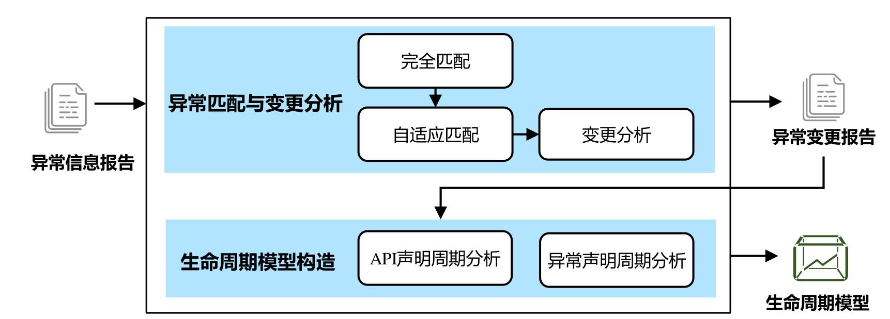
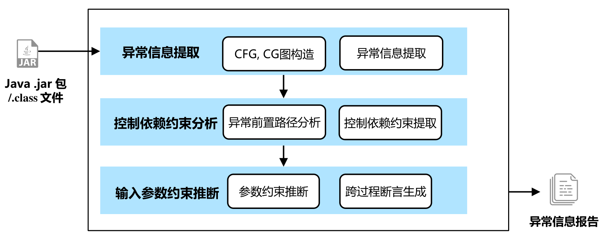
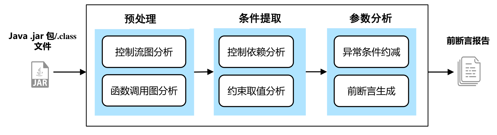

# JavaExP

Java Exception-aware API analyzer, build exception-aware API lifecycle model

## Install Requirements

1. Python 3.8

2. Java 11

3. maven 3.6.3

# Paper Information

## Exception-aware Lifecycle Model Construction for Framework APIs

### Abstract

The implementation of complex software systems usually depends on low-level frameworks or third-party libraries. However, the evolution of these frameworks or libraries is independent of the upper-level applications. During code evolution, the newly added, removed, or modified APIs may lead to misuse of APIs or even cause unexpected compatibility problems. Therefore, precisely analyzing and constructing the framework/library’s API lifecycle model is of great importance, which could help in understanding changes in APIs as well as supporting the analysis and testing of upper-level code. Nowadays, existing works propose the API existence-changing model for defect detection, while not considering the influence of semantic changes in APIs. In some cases, developers will not remove or deprecate APIs but modify their semantics by adding, removing, or modifying their exception-thrown code, which is used to verify the users’ inputs. To obtain the exception-aware API lifecycle model, on the one hand, it is necessary to precisely extract the exception information in each API, such as the exception type, description message, pre-condition of all the thrown exceptions, etc. It is also necessary to match exception instances among multiple framework/library versions and identify the exception-changing process.

To achieve automatic exception summary extraction and API evolution analysis, this paper adopts the static analysis technique to extract the exception summary information in the framework API code and adopts a multi-step matching strategy to obtain the changing process of exceptions. Then, it generates exception-aware API lifecycle models for the given framework/library project. Our approach: 1) adopts control-dependency slicing analysis to extract the conditions of the exception-thrown statements; uses a parameter tracing strategy to transform exception-throwing conditions into external-variable-related preconditions; and performs inter-procedure precondition construction by a bottom-up summary-based analysis. 2) proposes the exact-matching and adaptive-matching strategies to analyze the addition, deletion, and modification changes based on the summarized exception summaries; generates exception-aware API lifecycle model which covers seven API changing types. With this approach, the API lifecycle extraction tool, JavaExP, is implemented, which is based on Java bytecode analysis. Compared to the state-of-the-art tool, JavaExP achieves both higher precision (+41.6%) and efficiency (+7x). By manually confirming the exception changing reports on 19 versions of Apache common-io project, we found that the precision of exception matching and changing results is 98%. The evaluation of 60 versions of six projects shows that, compared to the exception-unaware API lifecycle modeling, JavaExp can identify 18% times more API changes. Among the 75,433 APIs under analysis, 20% of APIs have changed their exception-throwing behavior at least once after API introduction. These APIs involve a total of more than 7k independent exception changes, which shows that the exception-aware lifecycle modeling can describe the evolution process of APIs more accurately.


### Key Words

static analysis; program evolution; Java exception summary; API lifecycle

## Evaluation

Visit `Evaluation` directory to download evaluation data

# Project Structure

Project mainly divided into two part: ExceptionExtracter and dataAnalysis.



ExceptionExtracter will generate exception report from a jar package of specific version



dataAnalysis take multiple exception report as input, match and analysis exceptions. Finally, it will build a exception-aware API lifecycle model



To use JavaExP and dataAnalysis, follow the following document

## Run ExceptionExtracter 

*Note: Only **English** characters are allowed in the path.*

```
# Initialize soot-dev submodule
git submodule update --init soot-dev

# Use -DskipTests to skip tests of soot (make build faster)
mvn -f pom.xml clean package -DskipTests

# Copy jar to root directory
cp target/JavaExP.jar JavaExP.jar 

# run JavaExP.jar, result will be output in [output folder]
python scripts/runJavaExP.py Benchmark [project under test in Benchmark folder] [output folder]

```

### Result 

In the "exceptionInfo" folder, you can get a file named "exceptionConditions.txt", which gives the list of generated exception preconditions for every method.

For example,

``` json
{
    "methodName": "<org.apache.commons.io.EndianUtils: int read(java.io.InputStream)>",
    "modifier": "private",
    "exceptions": [
        {
            "exceptionName": "java.io.EOFException",
            "message": "\\QUnexpected EOF reached\\E",
            "method": "<org.apache.commons.io.EndianUtils: int read(java.io.InputStream)>",
            "modifier": "private",
            "throwUnit": "throw $r2",
            "callChain": "throw $r2",
            "throwUnitOrder": 0,
            "conditions": "$i2 != $i0",
            "preConditions": [
                "-1 is virtualinvoke parameter0.<java.io.InputStream: int read()>()"
            ],
            "keyPreCondition": "-1 is virtualinvoke parameter0.<java.io.InputStream: int read()>()"
        }
    ]
}
```

It gives the exception precondition for method caller in the of the following code snippets.

``` java
    private static int read( InputStream input )
    throws IOException
{
    int value = input.read();

    if( -1 == value )
    {
        throw new EOFException( "Unexpected EOF reached" );
    }

    return value;
}
```

## Run dataAnalysis

Before run dataAnalysis, ensure you have generated **multiple exception report for same library**

dataAnalysis tool located in folder `script/dataAnalysis` and create directory named `original_data` here, copy exception reports to this directory

**Change `id` variable** in `config.py` file according your exception report

Then you can execute following command to build a exception-aware API lifecycle model

``` bash
# ensure change working directory to dataAnalysis folder
cd script/dataAnalysis

# run preprocess
./preprocess.py

# run reporter
./reporter.py

# run report_analysis
./report_analysis.py
```

After that, you will see the result in `statistic_result`, this result structure like following:

``` text
+-- apache-results-inter
|   +-- changed-data  # all changed exception, classified by different changed type
|   |   +-- added_api.json
|   |   +-- added_exceptions.json
|   |   +-- message_changed_exceptions.json
|   |   +-- pre_conditions_changed_exceptions.json
|   |   +-- removed_api.json
|   |   +-- removed_exceptions.json
|   |   +-- type_changed_exceptions.json
|   +-- figures  # figures that shows some api lifetime information
|   |   +-- ...
|   +-- lifetime-data  # api information classified by different api lifetime
|   |   +-- ...
|   +-- exception_level_methods.json  # exception level methods that only include public method and non-public which is invoked public method
|   +-- filter_api.json  # all api that filter some irrelevant method
|   +-- statistic.json  # statistic data
```
