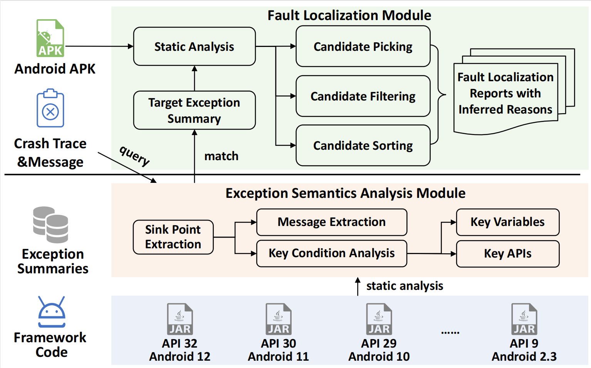
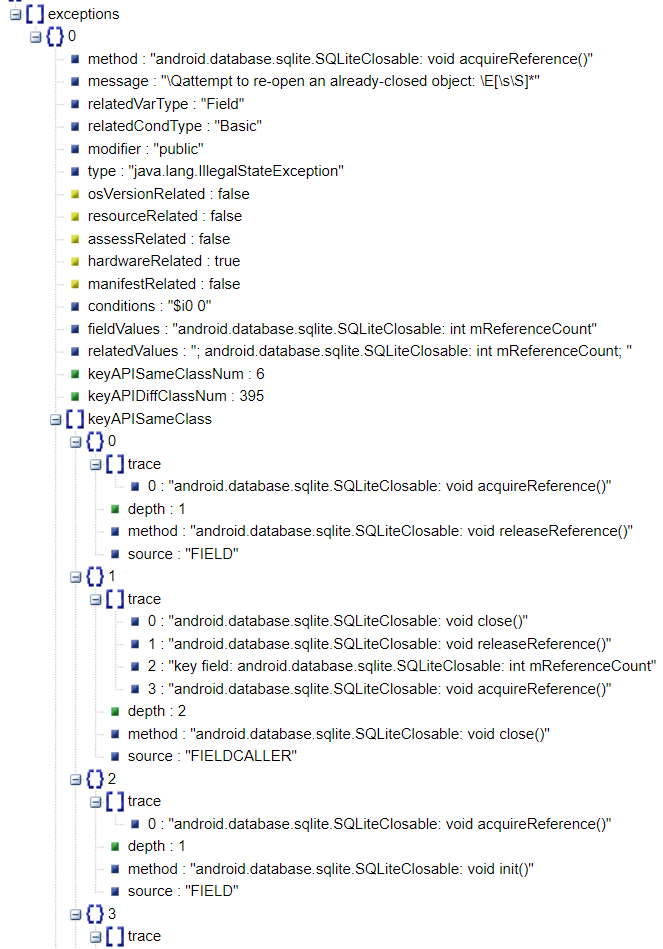

# ExceptionExtractor


## Tool Overview
<p align="left">

</p>

## Install Requirements

1. Python 3.8
2. Java 11
3. maven 3.6.3
4. Linux OS  (by default)
5. When using Windows, the separator should be changed from / to  \\ for part of commands.  Also, please use the Windows PowerShell to execute commands.

## Steps to run *ExceptionExtractor* 

*Note: Only **English** characters are allowed in the path.*

First，

```
# Initialize soot-dev submodule
git submodule update --init soot-dev

# Use -DskipTests to skip tests of soot (make build faster)
mvn -f pom.xml clean package -DskipTests

# Copy jar to root directory
cp target/ExceptionExtractor.jar ExceptionExtractor.jar

```
**Use the following commands to analyze your framework files.**

python scripts/runExceptionExtractor-framework.py [framework code location] [version] [outputDir]  

For example, if the sturcture of your files is as follows:
- ExceptionExtractorTool
    |-- framework
     |-- android5.0
        |-- a list of .class files extracted from android.jar files (do not use the android.jar file in the Android SDK, as they 			have empty implementation. Instead, extract android.jar files from your android phone or an emulator with the target 			version. Also, you can download from  https://github.com/hanada31/AndroidFrameworkImpl and unzip files)

run: 
    python scripts/runExceptionExtractor-framework.py  M_framework 2.3 ETSResults
```

## ExceptionExtractor.jar -h Arguments

```
java -jar ExceptionExtractor.jar -h

usage: java -jar ExceptionExtractor.jar [options] [-path] [-name] [-androidJar] [-outputDir] [-crashInput] [-exceptionInput] [-client]
 -h                        -h: Show the help information.
 -client <arg>             -client 
 						   	   ExceptionInfoClient: Extract exception information from Android framework.
                               CrashAnalysisClient: Analysis the crash information for an apk.
                               JarCrashAnalysisClient: Analysis the crash information for an third party SDK.
                               CallGraphClient: Output call graph files.
                               ManifestClient: Output manifest.xml file.
                               IROutputClient: Output soot IR files.
 -name <arg>               -name: Set the name of the apk under analysis.
 -path <arg>               -path: Set the path to the apk under analysis.
 -crashPath <arg>          -crashInput: crash information file.
 -exceptionInput <arg>     -exceptionPath: exception file folder.
 -androidJar <arg>         -androidJar: Set the path of android.jar.
 -frameworkVersion <arg>   -frameworkVersion: The version of framework under analysis
 -strategy <arg>           -strategy: effectiveness of strategy "NoCallFilter", "NoSourceType", "ExtendCGOnly",  "NoKeyAPI", "NoParaChain, "NoAppDataTrace", "NOParaChainANDDataTrace"or "no"
 -time <arg>               -time [default:90]: Set the max running time (min).
 -outputDir <arg>          -outputDir: Set the output folder of the apk.


## Examples for Exception-Thrown Summary (ETS)

In folder Files




